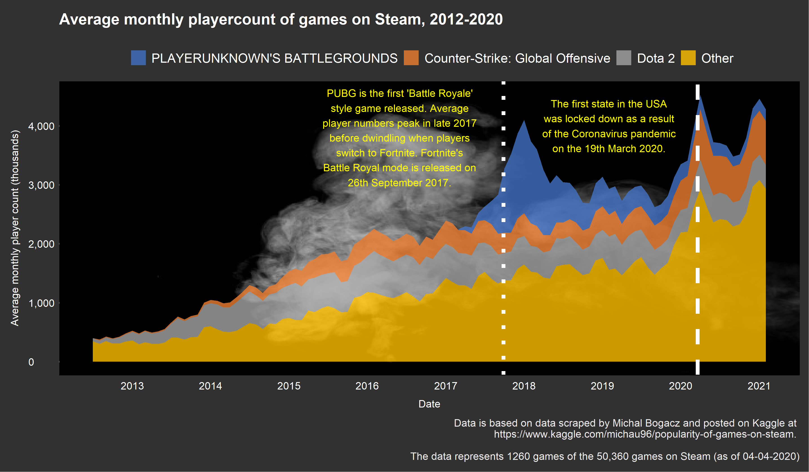

# TidyTuesday
 
Collection of my data vizzes for #TidyTuesday!

 

### #6 05/04/2022

Haven't done a TidyTuesday plot in about a year .... oops
 
North American News Corporation Revenue Streams [(View Code)](Rcode/2022_04_05_NewsOrgs.R)

 
 

### #5 06/04/2021

Decided to get a bit more creative and make this one into a gif, took far too long to try and work out how to mock up a stacked bar inside of a country outline!
 
Largest causes of deforestation in the Brazilian Amazon 2001 - 2013 [(View Code)](Rcode/2021_04_06_GlobalDeforestation.R)

 
 

### #4 23/03/2021

Haven't done a chloropleth yet in R so thought it was probably about time
 
UN members and the world issues that they vote 'no' to most [(View Code)](Rcode/2021_03_23_UNVotes.R)

 
 

### #3 16/03/2021

 
Steam game popularity over time [(View Code)](Rcode/2021_03_16_VideoGames.R)

 
 

### #2 09/02/2021

Fancied having a play around with cowplot to try and see how to organise plots neatly for future infographics
 
Wealth and Income by Race and Generation [(View Code)](Rcode/2021_02_09_WealthAndIncome.R)

 
 

### #1 02/03/2021

Thought it might be a good idea to start trying to improve my data visualisation skills
 
Superbowl adverts [(View Code)](Rcode/2021_03_02_NFLAdverts.R)

